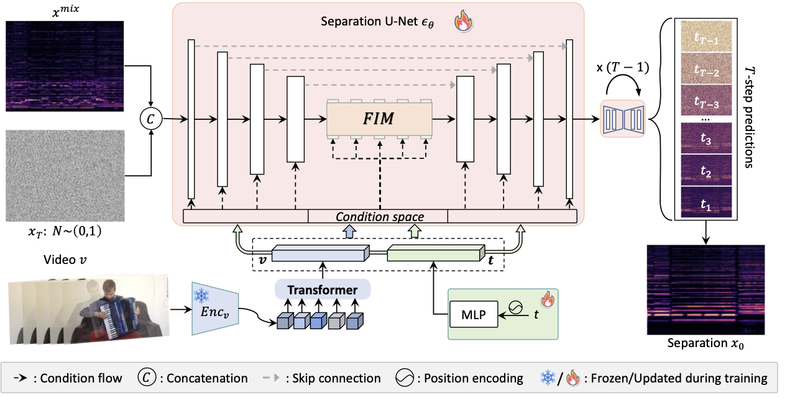

# High-Quality Visually-Guided Sound Separation from Diverse Categories
> **Chao Huang, Susan Liang, Yapeng Tian, Anurag Kumar, Chenliang Xu**
>
> We propose DAVIS, a Diffusion-based Audio-VIsual Separation framework that solves the audio-visual sound source separation task through generative learning. Existing methods typically frame sound separation as a mask-based regression problem, achieving significant progress. However, they face limitations in capturing the complex data distribution required for high-quality separation of sounds from diverse categories. In contrast, DAVIS leverages a generative diffusion model and a Separation U-Net to synthesize separated sounds directly from Gaussian noise, conditioned on both the audio mixture and the visual information. With its generative objective, DAVIS is better suited to achieving the goal of high-quality sound separation across diverse sound categories. We compare DAVIS to existing state-of-the-art discriminative audio-visual separation methods on the AVE and MUSIC datasets, and results show that DAVIS outperforms other methods in separation quality, demonstrating the advantages of our framework for tackling the audio-visual source separation task.

<a href="https://wikichao.github.io/data/projects/DAVIS/"></a> 
<a href="https://arxiv.org/pdf/2308.00122v2"></a> <a href="https://arxiv.org/pdf/2509.22063"></a><h5 align="center"> If our project helps you, please give us a star ⭐ on GitHub to support us. </h5>

<p align="center">

</p>

## News
* **2025-09:** 🚀 **DAVIS-Flow** is accepted to IJCV!
* **2025-04:** **NEW: DAVIS-Flow released!** Leveraging Flow Matching for faster training and better separation quality. [Try it now!](#davis-flow)
* **2024-12:** 🏆 DAVIS won ACCV’24 Best Paper Award, Honorable Mention! 
* **2024-09:** DAVIS is accepted as **ACCV 2024 Oral** Presentation.

## Installation
Create a conda environment and install dependencies:
```bash
git clone https://github.com/WikiChao/DAVIS.git
cd DAVIS

conda create --name DAVIS python=3.8
conda activate DAVIS

pip install -r requirements.txt
```

or install the following libraries by yourself:
```bash
torch
torchvision
librosa
soundfile
clip
einops
tqdm
mir_eval
scipy
imageio
```

## Dataset

### 1. Download Datasets

- **MUSIC Dataset:**  
  Download from [MUSIC Dataset GitHub](https://github.com/roudimit/MUSIC_dataset).  

- **AVE Dataset:**  
  Download from [AVE Dataset GitHub](https://github.com/YapengTian/AVE-ECCV18).

> **Note:** Some YouTube IDs in the MUSIC dataset are no longer valid. As a temporary solution, we will provide zipped data to help you get started: [MUSIC Dataset Download](https://drive.google.com/file/d/1NFdvqUGBmVeb6oQwcDLgk6US5I-FErK9/view?usp=sharing).

---

### 2. Preprocess Videos

Preprocess the videos according to your needs, ensuring the index files are consistent.  

- **Frame Extraction:** Refer to `./preprocessing/extract_frames.py`.  
- **Audio Extraction:** Extract waveforms at 11,025 Hz. You can use `./preprocessing/extract_audio.py`.

---

### 3. Data Splits

We provide `.csv` index files for training and testing.  
The index files are located at:  
- `./data/MUSIC` for MUSIC  
- `./data/AVE` for AVE  

---

### 4. Directory Structure

The directory structure for the datasets is as follows:  


    ```
    data
    ├── audio
    |   ├── acoustic_guitar
    │   |   ├── M3dekVSwNjY.wav
    │   |   ├── ...
    │   ├── trumpet
    │   |   ├── STKXyBGSGyE.wav
    │   |   ├── ...
    │   ├── ...
    |
    └── frames
    |   ├── acoustic_guitar
    │   |   ├── M3dekVSwNjY.mp4
    │   |   |   ├── 000001.jpg
    │   |   |   ├── ...
    │   |   ├── ...
    │   ├── trumpet
    │   |   ├── STKXyBGSGyE.mp4
    │   |   |   ├── 000001.jpg
    │   |   |   ├── ...
    │   |   ├── ...
    │   ├── ...

    ```


## Training

Modify ``/YOUR_ROOT`` to the directory you store the data in the ``./dataset/ave.py`` and ``./dataset/music.py``, and also the ``YOUR_CKPT`` in the ``run.sh`` and ``run_ave.sh``.

We provide a minimal example to launch the training. To get started, try running:

```bash
cd scripts

bash run.sh # for MUSIC dataset

or 

bash run_ave.sh # for AVE dataset
```

## Evaluation

To launch the evaluation, modify the following arguments in ``run.sh`` or ``run_ave.sh`` to the following:

```bash
OPTS+="--split test "
OPTS+="--mode eval"
```

## DAVIS-Flow
DAVIS-Flow is our improved version that leverages flow matching techniques for faster training and improved separation quality.

### Training and Inference
Use the following scripts:
* For MUSIC dataset: ``run_fm.sh``
* For AVE dataset: ``run_ave_fm.sh``

## Model Zoos
Our pre-trained models are available for download. Use these models to quickly get started.

| Dataset | DAVIS | DAVIS-Flow |
|---------|-------|------------|
| MUSIC   | [Download](https://drive.google.com/drive/folders/1yqJwSR46oh7R1JSepsXa1OPgNanTCPU4?usp=sharing) | [Download](https://drive.google.com/drive/folders/1KRbVpi1KYKMoQCQYftnavLz0CnB0KEuY?usp=sharing) |
| AVE     | - | [Download](https://drive.google.com/drive/folders/1M-ZpE2yK3mQ_qMfXL3J9kACGfdD4Mcnv?usp=sharing) |

All models are ready for inference using the evaluation scripts described in the previous sections.

## Acknowledgements

We borrow code from the following repositories [CCoL](https://github.com/YapengTian/CCOL-CVPR21), [diffusion-pytorch](https://github.com/lucidrains/denoising-diffusion-pytorch) and [iQuery](https://github.com/JiabenChen/iQuery).

## Citation
If you use this code for your research, please cite the following work: 

DAVIS-Flow:
```
@article{huang2025high,
  title={High-Quality Sound Separation Across Diverse Categories via Visually-Guided Generative Modeling},
  author={Huang, Chao and Liang, Susan and Tian, Yapeng and Kumar, Anurag and Xu, Chenliang},
  journal={arXiv preprint arXiv:2509.22063},
  year={2025}
}
```
and DAVIS:
```
@InProceedings{Huang_2024_ACCV,
    author    = {Huang, Chao and Liang, Susan and Tian, Yapeng and Kumar, Anurag and Xu, Chenliang},
    title     = {High-Quality Visually-Guided Sound Separation from Diverse Categories},
    booktitle = {Proceedings of the Asian Conference on Computer Vision (ACCV)},
    month     = {December},
    year      = {2024},
    pages     = {35-49}
}
```
